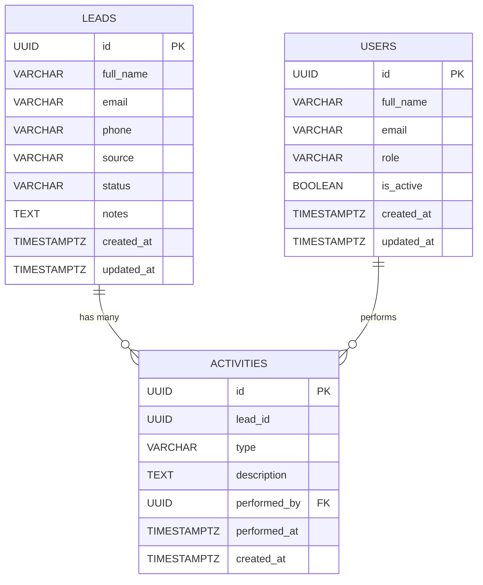

# Database Schema & Kafka Event Formats

> Detailed schema definitions for PostgreSQL databases and Kafka event JSON payloads used in the Sales Lead Management Tool.

---

## 1. PostgreSQL — Leads Database

Owned by the **Lead Service**. Stores all sales lead data.

### 1.1 `leads` Table

```sql
CREATE TABLE leads (
    id              UUID PRIMARY KEY DEFAULT gen_random_uuid(),
    full_name       VARCHAR(255)    NOT NULL,
    email           VARCHAR(255)    NOT NULL,
    phone           VARCHAR(50),
    source          VARCHAR(100)    NOT NULL DEFAULT 'website',   -- e.g. 'website', 'referral', 'walk-in'
    status          VARCHAR(50)     NOT NULL DEFAULT 'new',       -- new | contacted | qualified | lost | won
    notes           TEXT,
    created_at      TIMESTAMPTZ     NOT NULL DEFAULT NOW(),
    updated_at      TIMESTAMPTZ     NOT NULL DEFAULT NOW()
);

-- Indexes
CREATE INDEX idx_leads_status     ON leads (status);
CREATE INDEX idx_leads_created_at ON leads (created_at DESC);
CREATE INDEX idx_leads_email      ON leads (email);
```

| Column | Type | Description |
|---|---|---|
| `id` | UUID | Primary key, auto-generated |
| `full_name` | VARCHAR(255) | Customer full name |
| `email` | VARCHAR(255) | Customer email address |
| `phone` | VARCHAR(50) | Customer phone number (optional) |
| `source` | VARCHAR(100) | Where the lead came from (`website`, `referral`, `walk-in`) |
| `status` | VARCHAR(50) | Lead lifecycle status: `new` → `contacted` → `qualified` → `won` / `lost` |
| `notes` | TEXT | Free-text notes from salesperson |
| `created_at` | TIMESTAMPTZ | When the lead was created |
| `updated_at` | TIMESTAMPTZ | Last modification timestamp |

---

## 2. PostgreSQL — Activities Database

Owned by the **Activity Service**. Stores users (salespeople), follow-up activities linked to leads, and the relationship between them.

### 2.1 `users` Table

```sql
CREATE TABLE users (
    id              UUID PRIMARY KEY DEFAULT gen_random_uuid(),
    full_name       VARCHAR(255)    NOT NULL,
    email           VARCHAR(255)    NOT NULL UNIQUE,
    role            VARCHAR(50)     NOT NULL DEFAULT 'salesperson',
    is_active       BOOLEAN         NOT NULL DEFAULT TRUE,
    created_at      TIMESTAMPTZ     NOT NULL DEFAULT NOW(),
    updated_at      TIMESTAMPTZ     NOT NULL DEFAULT NOW()
);

-- Indexes
CREATE INDEX idx_users_email     ON users (email);
CREATE INDEX idx_users_is_active ON users (is_active);
```

| Column | Type | Description |
|---|---|---|
| `id` | UUID | Primary key, auto-generated |
| `full_name` | VARCHAR(255) | Salesperson full name |
| `email` | VARCHAR(255) | Unique email address (used for login/identification) |
| `role` | VARCHAR(50) | User role (default: `salesperson`) |
| `is_active` | BOOLEAN | Soft-delete flag |
| `created_at` | TIMESTAMPTZ | When the user was created |
| `updated_at` | TIMESTAMPTZ | Last modification timestamp |

### 2.2 `activities` Table

```sql
CREATE TABLE activities (
    id              UUID PRIMARY KEY DEFAULT gen_random_uuid(),
    lead_id         UUID            NOT NULL,                      -- references leads.id (cross-service, not FK)
    type            VARCHAR(100)    NOT NULL,                      -- e.g. 'phone_call', 'email', 'meeting', 'note'
    description     TEXT            NOT NULL,                      -- e.g. "Called customer — left voicemail"
    performed_by    UUID            NOT NULL REFERENCES users(id), -- FK to users table
    performed_at    TIMESTAMPTZ     NOT NULL DEFAULT NOW(),
    created_at      TIMESTAMPTZ     NOT NULL DEFAULT NOW()
);

-- Indexes
CREATE INDEX idx_activities_lead_id       ON activities (lead_id);
CREATE INDEX idx_activities_performed_at  ON activities (lead_id, performed_at DESC);
CREATE INDEX idx_activities_performed_by  ON activities (performed_by);
CREATE INDEX idx_activities_type          ON activities (type);
```

> **Note**: `lead_id` is **not** a foreign key because the Activities DB is a separate database from the Leads DB (database-per-service pattern). Referential integrity is enforced at the application level. However, `performed_by` **is** a foreign key to `users.id` since both tables live in the same database.

| Column | Type | Description |
|---|---|---|
| `id` | UUID | Primary key, auto-generated |
| `lead_id` | UUID | ID of the associated lead (from Lead Service) |
| `type` | VARCHAR(100) | Activity type: `phone_call`, `email`, `meeting`, `note` |
| `description` | TEXT | Detailed description of the follow-up activity |
| `performed_by` | UUID (FK → `users.id`) | The salesperson who performed the activity |
| `performed_at` | TIMESTAMPTZ | When the activity was performed |
| `created_at` | TIMESTAMPTZ | Record creation timestamp |

---

## 3. Kafka Event JSON Formats

All events are published as JSON with a simplified **type/data structure**:

### 3.1 Event Structure

| Field | Type | Description |
|---|---|---|
| `type` | string | Event name (e.g. `lead.created`) |
| `data` | object | Event-specific data payload |

---

### 3.2 Topic: `lead-events`

#### `lead.created`

Published when a new lead is submitted.

```json
{
  "type": "lead.created",
  "data": {
    "id": "lead-001",
    "fullName": "John Doe",
    "email": "john.doe@example.com",
    "phone": "+1-555-0123",
    "source": "website",
    "status": "new",
    "createdAt": "2026-03-17T08:15:30.123Z"
  }
}
```

---

### 3.3 Topic: `activity-events`

#### `activity.created`

Published when a salesperson logs a new follow-up activity.

```json
{
  "type": "activity.created",
  "data": {
    "id": "act-001",
    "leadId": "lead-001",
    "type": "phone_call",
    "description": "Called customer — left voicemail about new SUV arrivals",
    "performedBy": "user-001",
    "performedAt": "2026-03-17T10:00:00.000Z"
  }
}
```

---

## 4. Entity Relationship Diagram



> The LEADS → ACTIVITIES relationship is **logical** (enforced by application code), not a physical FK, since they live in separate databases. The USERS → ACTIVITIES relationship **is** a physical FK within the Activities database.

---

## 5. Prisma Schema Reference

For implementation with **Prisma ORM**, the schemas would look like:

### Lead Service — `prisma/schema.prisma`

```prisma
model Lead {
  id        String   @id @default(uuid())
  fullName  String   @map("full_name")
  email     String
  phone     String?
  source    String   @default("website")
  status    String   @default("new")
  notes     String?
  createdAt DateTime @default(now()) @map("created_at")
  updatedAt DateTime @updatedAt @map("updated_at")

  @@map("leads")
  @@index([status])
  @@index([createdAt(sort: Desc)])
  @@index([email])
}
```

### Activity Service — `prisma/schema.prisma`

```prisma
model User {
  id        String     @id @default(uuid())
  fullName  String     @map("full_name")
  email     String     @unique
  role      String     @default("salesperson")
  isActive  Boolean    @default(true) @map("is_active")
  createdAt DateTime   @default(now()) @map("created_at")
  updatedAt DateTime   @updatedAt @map("updated_at")

  activities Activity[]

  @@map("users")
  @@index([email])
  @@index([isActive])
}

model Activity {
  id          String   @id @default(uuid())
  leadId      String   @map("lead_id")
  type        String
  description String
  performedBy String   @map("performed_by")
  performedAt DateTime @default(now()) @map("performed_at")
  createdAt   DateTime @default(now()) @map("created_at")

  user        User     @relation(fields: [performedBy], references: [id])

  @@map("activities")
  @@index([leadId])
  @@index([leadId, performedAt(sort: Desc)])
  @@index([performedBy])
  @@index([type])
}
```
